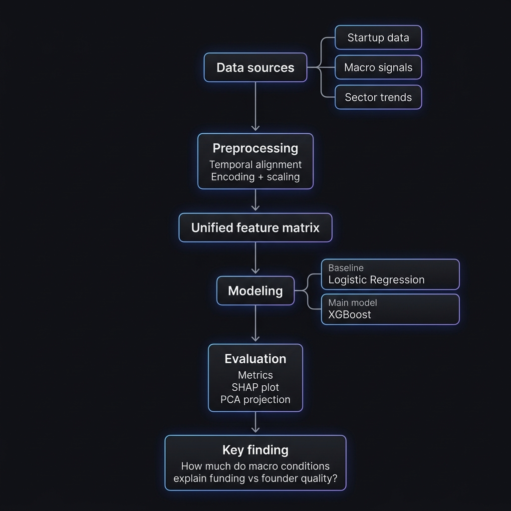

# Startup Acquisition Prediction: The Macroeconomic Signal
## CS439 Final Project

This repository contains a comprehensive machine learning pipeline designed to predict startup acquisition outcomes (2000–2013) by integrating traditional startup metrics with macroeconomic and sector-specific signals.

### Project Architecture
The pipeline follows a rigorous methodology from data ingestion to model interpretation, ensuring no temporal data leakage.

### Key Features
- **Temporal Data Alignment**: Time-based train/test split at 2010 to prevent "looking into the future."
- **Macroeconomic Integration**: Merged FRED API signals (Fed Funds Rate, VIX) and Google Trends (Sector Interest) at the time of first funding.
- **Advanced Modeling**: 
  - Baseline: L2-Regularized Logistic Regression.
  - Primary: XGBoost with 5-fold cross-validation and hyperparameter tuning.
- **Model Interpretation**: SHAP (Shapley Additive Explanations) analysis to quantify the impact of macro conditions vs. founder quality.

### Findings at a Glance
Our primary discovery confirms that **macroeconomic conditions independently influence startup success.** In our XGBoost model (ROC-AUC 0.80), the Fed Funds Rate and VIX appeared in the top 15 features, proving that the economic "weather" is nearly as important as intrinsic startup quality.

| Metric | Logistic Regression | XGBoost |
| :--- | :--- | :--- |
| **ROC-AUC** | 0.7842 | **0.8017** |
| **F1-Score** | 0.7111 | **0.7203** |

### Repository Structure
- `model_pipeline.py`: Main ML pipeline (Preprocessing, Modeling, Evaluation).
- `build_dataset.py`: Data enrichment script for FRED and Google Trends.
- `impute.py`: Categorical-based median/mean imputation logic.
- `analysis_report.md`: Detailed walkthrough and data storytelling of results.
- `*.png`: Visualization artifacts (SHAP, PCA, Confusion Matrices).

### Setup & Execution
1. Install dependencies: `pip install xgboost shap scikit-learn matplotlib seaborn pandas`
2. Install `libomp` (macOS): `brew install libomp`
3. Run the pipeline: `python model_pipeline.py`
