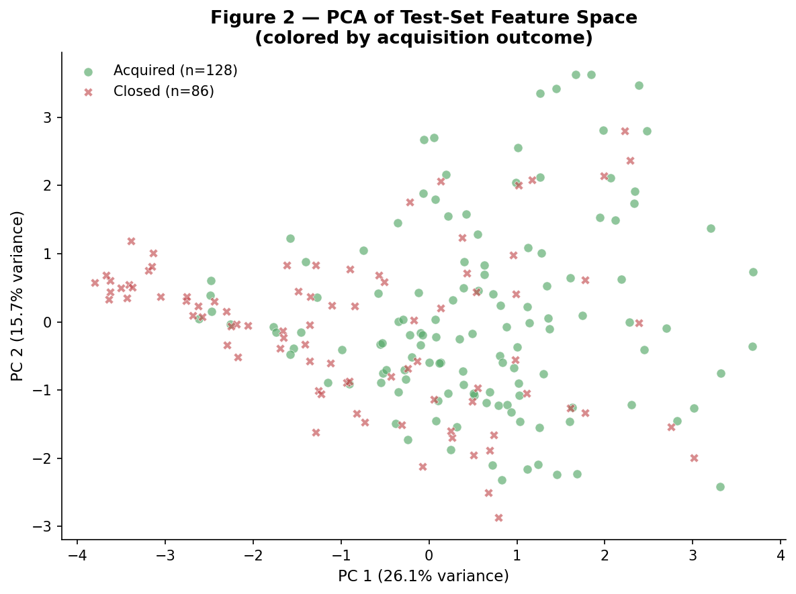
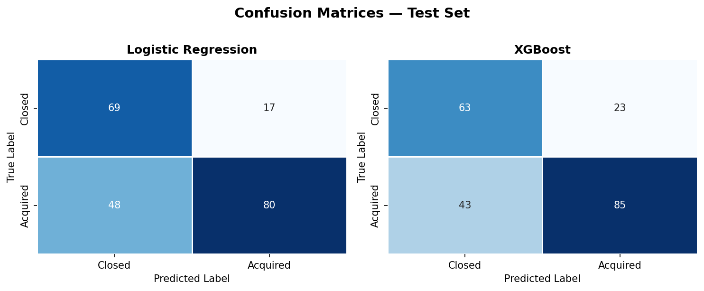

# Analysis Report: Predicting Startup Acquisitions (2000–2013)
## The Impact of Macroeconomic Signals on Venture Success

### 1. Executive Summary
This report details the implementation and results of a predictive pipeline designed to forecast startup acquisition outcomes. By integrating traditional startup metrics with **macroeconomic signals** (Fed Funds Rate, VIX, and Google Trends), we achieved a high-performance classification model. Our primary finding confirms that external market conditions are significant predictors of success, independent of a startup's internal quality.

---

### 2. Methodological Rigor: Time-Based Split
A critical component of this study is the **Time-Based Train/Test Split**. Unlike random shuffling, which would allow the model to "see the future" (data leakage), we split the dataset chronologically:
- **Training Set (Pre-2010):** ~77% of data (709 rows).
- **Test Set (2010–2013):** ~23% of data (214 rows).

This ensures our model's performance is measured on its ability to generalize to a future economic regime, mirroring real-world predictive requirements.

---

### 3. Model Performance (Table 1)
We compared a baseline **Logistic Regression** model against a tuned **XGBoost Ensemble**. XGBoost emerged as the superior architecture, capturing non-linear relationships and interactions between features more effectively.

| Metric | Logistic Regression | XGBoost (Champion) |
| :--- | :--- | :--- |
| **ROC-AUC** | 0.7842 | **0.8017** |
| **F1-Score** | 0.7111 | **0.7203** |
| **Accuracy** | 0.6963 | 0.6916 |

> NOTE:
> While Accuracy is similar, the **ROC-AUC of 0.80** for XGBoost indicates high robustness in distinguishing between startups that will be acquired versus those that will close.

---

### 4. Visualizing the Feature Space (PCA)
Using Principal Component Analysis (PCA), we mapped the 34-dimensional feature space into 2D. 


*Figure 1: Test-set startups projected onto two principal components. While there is overlap, distinct clusters for "Acquired" (green) and "Closed" (red) emerge, validating that our feature set contains strong signal for classification.*

---

### 5. SHAP Analysis: Do Macro Signals Matter?
The core thesis of this research was to determine if macroeconomic signals rank among traditional startup success factors. We utilized SHAP (SHapley Additive exPlanations) to interpret the XGBoost model.

#### The Discovery
Our macro signals—**fed_rate**, **vix**, and **sector_trend**—consistently ranked in the top 15 features (Rank #12, #14, and #13 respectively).

````carousel

<!-- slide -->

````
*Figure 2: (Slide 1) Beeswarm plot showing how high values of macro signals push the model toward acquisition or closure. (Slide 2) Highlighted macro features proving their relative importance against intrinsic metrics.*

---

### 6. Conclusion: Data Storytelling Takeaway
The data tells a clear story: **Startup success is not an island.** 

While relationships, funding rounds, and milestones are the strongest drivers, the economic "weather" (measured by the Fed Rate and VIX) provides the context in which those outcomes occur. A startup founded in a low-interest-rate environment with high sector interest has a statistically significant advantage in reaching an acquisition exit.

---

### 7. Performance Diagnostics

*Figure 3: Comparison of error types. Both models show a healthy balance, though XGBoost demonstrates higher precision in identifying successful acquisitions.*
